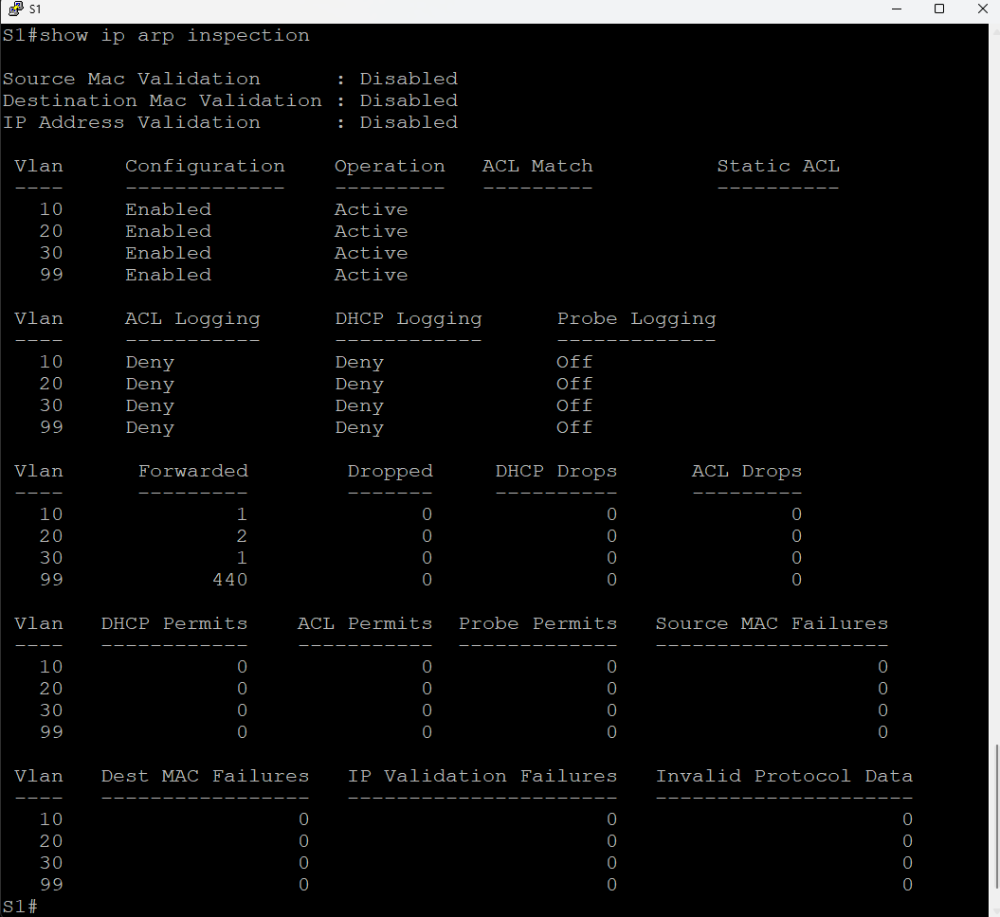
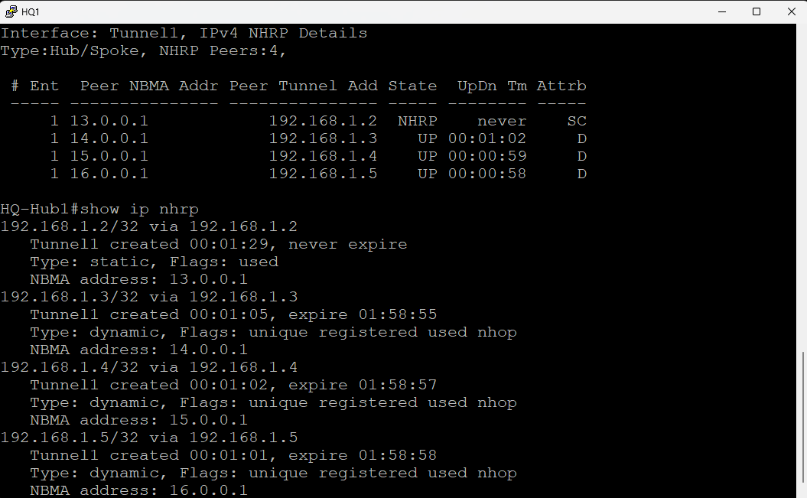
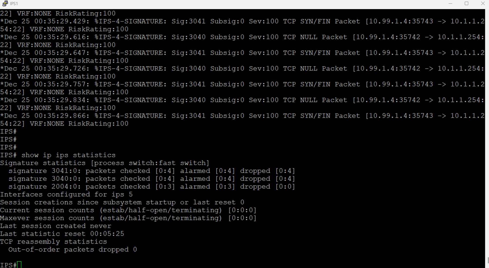
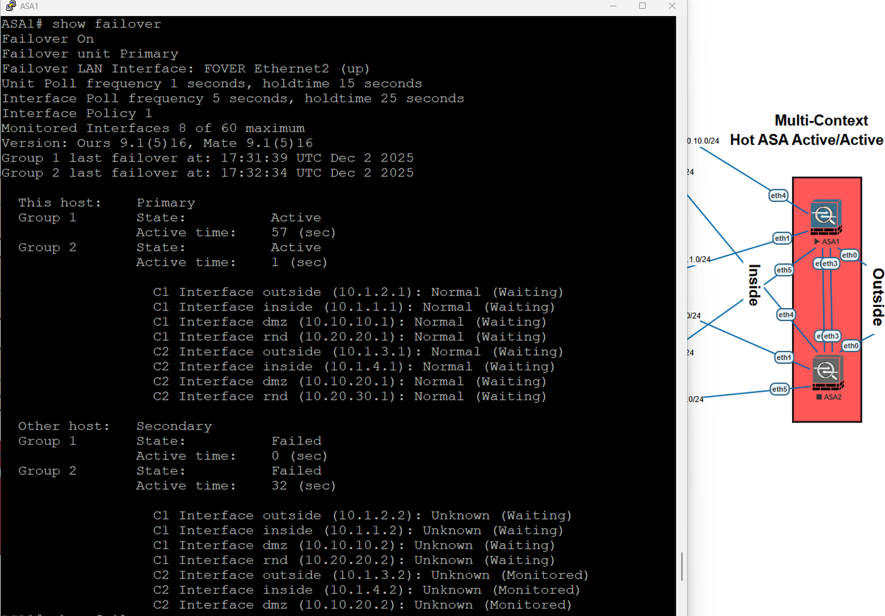

<div align="center">

<br>

<div align="center">

<br>

<div align="center">


<br>

<p>
  
  
  
  
  
</p>

</div>

<br><br>

<p align="center">
  
  
  
  
</p>

<br>

> *A university group project for Defense-in-Depth Networking Security.*
> *VLAN Segmentation · DMVPN/IPsec · Cisco IOS IPS · ASA Firewall HA · AAA/RBAC · NAT/ACLs.*

<br>

</div>

---

## Table of Contents

- [Overview](#overview)
- [Topology](#topology)
- [Core Objectives](#core-objectives)
- [Network Segmentation](#network-segmentation)
- [Security Controls Implemented](#security-controls-implemented)
- [VPN and Inter-Branch Connectivity](#vpn-and-inter-branch-connectivity)
- [IDS/IPS Deployment](#idsips-deployment)
- [Firewall High Availability](#firewall-high-availability)
- [AAA and RBAC](#aaa-and-rbac)
- [Validation Summary](#validation-summary)
- [Repository Structure](#repository-structure)

---

## Overview

This repository presents a university group project completed for the **Defense-in-Depth Networking Security** course. The project focuses on building and validating a secure enterprise network infrastructure using multiple layers of protection.

The network was designed to protect internal departments, management services, DMZ services, branch communication, and sensitive internal zones. This repository explains the project using the topology diagram, configuration screenshots, validation screenshots, and short descriptions of the implemented security controls.

---

## Topology

The following topology shows the full enterprise network design, including the HQ hubs, branch routers, ISP connection, core layer, IPS device, ASA firewalls, DMZ, RND zone, and internal VLANs.


---

## Core Objectives

| Objective | Description |
|---|---|
| Network Segmentation | Separate departments using VLANs for Marketing, Sales, HR, and Management |
| L2/L3 Security Hardening | Protect the network from spoofing, MITM attacks, rogue devices, and broadcast storms |
| Secure Branch Connectivity | Use dual-hub DMVPN with IPsec to connect HQ and branch offices |
| IDS/IPS Protection | Deploy Cisco IOS IPS inline to detect and prevent malicious traffic |
| Firewall Enforcement | Use ASA firewalls with Active/Active failover, NAT, ACLs, and security zones |
| AAA/RBAC Access Control | Implement centralized authentication and role-based access using RADIUS and parser views |
| Validation Testing | Verify the security controls using practical testing and screenshots |

---

## Network Segmentation

The internal network was divided into separate VLANs for different departments.

| VLAN | Department | Network |
|---|---|---|
| VLAN 10 | Marketing | 10.10.1.0/26 |
| VLAN 20 | Sales | 10.20.1.0/26 |
| VLAN 30 | HR | 10.30.1.0/26 |
| VLAN 99 | Management | 10.99.1.0/24 |

Each VLAN works as a separate broadcast domain. This reduces unnecessary traffic, improves security, and limits lateral movement between departments.

The Management VLAN was separated from normal user VLANs to protect administrative access and management services.


---

## Security Controls Implemented

| Control | Purpose |
|---|---|
| Port Security | Restricts unauthorized devices from connecting to access ports |
| DHCP Snooping | Blocks rogue DHCP servers and helps prevent DHCP starvation attacks |
| Dynamic ARP Inspection | Prevents ARP spoofing and Man-in-the-Middle attacks |
| BPDU Guard | Disables access ports that receive unexpected BPDU packets |
| Root Guard | Prevents rogue switches from becoming the STP root bridge |
| Loop Guard | Protects against switching loops caused by link failures |
| Rate Limiting | Reduces DHCP flooding and Layer 2 DoS attempts |
| RFC1918 ACLs | Blocks spoofed private IP traffic from untrusted interfaces |
| OSPF Authentication | Protects routing updates from tampering and route injection |
| SSH v2 | Secures remote management access |

These controls protect both the access layer and routing/control plane.




---

## VPN and Inter-Branch Connectivity

A dual-hub DMVPN architecture was implemented to securely connect the headquarters with branch offices.

| Site | Role |
|---|---|
| HQ-Hub1 | Primary DMVPN Hub |
| HQ-Hub2 | Secondary DMVPN Hub |
| Dubai | Spoke Router |
| Riyadh | Spoke Router |
| Doha | Spoke Router |

The DMVPN design provides encrypted branch communication, dynamic spoke registration using NHRP, EIGRP routing over the tunnel, and high availability using two HQ hubs.

| Feature | Purpose |
|---|---|
| DMVPN | Provides scalable branch-to-branch connectivity |
| IPsec | Encrypts traffic between sites |
| NHRP | Allows spokes to register with the hubs |
| EIGRP | Provides dynamic routing across the DMVPN tunnel |
| Dual-Hub Design | Provides redundancy and failover |



---

## IDS/IPS Deployment

A Cisco IOS IPS device was deployed inline to inspect traffic and detect malicious activity before it reached internal network segments.

| Threat Type | IPS Response |
|---|---|
| Port scans | Generate alerts |
| TCP NULL scans | Alert and deny packets inline |
| TCP SYN/FIN scans | Alert and deny packets inline |
| Reconnaissance traffic | Detect suspicious scan behavior |
| Policy violations | Log and alert for SOC visibility |

The IPS validation included scan activity, alert generation, and packet drop evidence.



---

## Firewall High Availability

Cisco ASA firewalls were configured using Active/Active failover and multi-context mode. The firewalls controlled traffic between the Outside, Inside, DMZ, and RND zones.

| Firewall Feature | Purpose |
|---|---|
| Active/Active Failover | Provides high availability |
| Multi-Context Mode | Separates firewall contexts and policies |
| Security Zones | Controls traffic between Outside, Inside, DMZ, and RND |
| Static NAT | Publishes selected DMZ services |
| Dynamic PAT | Allows internal users to access outside networks |
| ACLs | Controls allowed and denied traffic |
| Object Groups | Simplifies firewall policy management |

Failover was tested by shutting down the active firewall and confirming that the standby firewall took over successfully.



---

## AAA and RBAC

AAA and RBAC were implemented to control administrative access using centralized authentication and role-based permissions.

| Role | Access Level |
|---|---|
| AdminView | Full administrative access |
| AuditView | Read-only auditing access |
| UserView | Limited user-level access |

This ensures that each user only receives the permissions required for their role.


---

## Validation Summary

| Validation Area | Result |
|---|---|
| VLAN segmentation | Verified |
| Port security | Verified |
| DHCP Snooping | Verified |
| Dynamic ARP Inspection | Verified |
| BPDU Guard | Verified |
| Root Guard | Verified |
| DMVPN connectivity | Verified |
| NHRP registration | Verified |
| IPS alerts | Verified |
| IPS packet drops | Verified |
| ASA failover | Verified |
| NAT and ACL enforcement | Verified |
| AAA/RBAC login tests | Verified |

---

## Repository Structure

```text
secure-enterprise-network-project/
│
├── README.md
│
└── images/
    ├── topology.png
    ├── vlan-database.png
    ├── svi-configuration.png
    ├── dhcp-snooping.png
    ├── dai-validation.png
    ├── dmvpn-validation.png
    ├── ips-alerts.png
    ├── asa-failover.png
    └── aaa-rbac-validation.png
